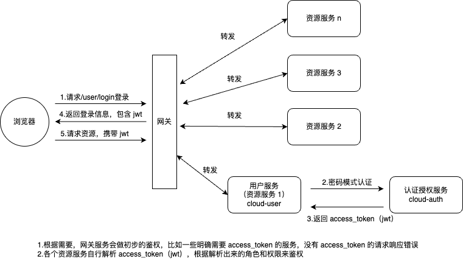

# cloud-oauth2-demo
spring-cloud  结合 oauth2 的单点登录示例，方案（spring-cloud-alibaba + spring-security + oauth2）

## 项目结构
| 模块             | 描述           |
|----------------|--------------|
| cloud-auth     | 认证授权服务       |
| cloud-common   | 通用代码模块       |
| cloud-gateway  | 网关服务         |
| cloud-user     | 用户服务（资源服务 1） |
| cloud-resource | 资源服务 2       |

## 工作流程

## TODO
- [x] 认证令牌刷新接口
- [x] 令牌 jwt 签名使用非对称加密
- [x] 登录增加校验码功能
- [x] 登录增加邮箱验证码功能

## 参考文档
- [Spring Cloud实战系列(十) -单点登录JWT与Spring Security OAuth](https://zhuanlan.zhihu.com/p/56401253)
